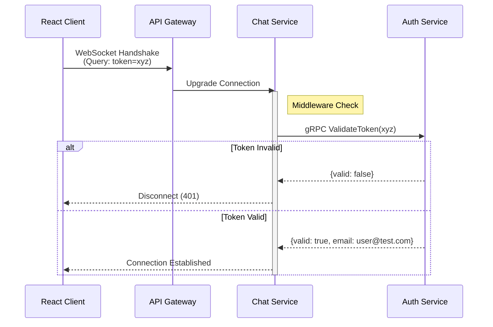

# PagePulse Microservices Architecture

PagePulse is a book reading platform built using a **Microservices Architecture**. This document details the system design, communication patterns, and service responsibilities.

## 🏗 Detailed System Architecture

The following diagram illustrates the complete flow of data, from the user's browser to the database, including synchronous (gRPC) and asynchronous (RabbitMQ) patterns.

```mermaid
flowchart TD
    %% === Clients ===
    User((User))
    Web["Web Client (React)"]

    %% === Gateway ===
    Nginx["Nginx API Gateway\n(Load Balancer, Proxy)"]

    %% === Services ===
    Auth["Auth Service\n(Express + gRPC + Postgres)"]
    Book["Book Service\n(Express + gRPC + Postgres + Redis)"]
    Chat["Chat Service\n(Socket.io + gRPC + Postgres)"]
    Notif["Notification Service\n(Express + MongoDB + RabbitMQ + Email)"]
    

    %% === Databases ===
    DB_Auth[("Postgres: AuthDB")]
    DB_Book[("Postgres: BookDB")]
    DB_Chat[("Postgres: ChatDB")]
    DB_Notif[("MongoDB: NotificationDB")]
    Redis[("Redis: Cache/Trending")]

    %% === Infra ===
    RabbitMQ{{"RabbitMQ Bus"}}
    Email["SMTP/Email Server"]

    %% === Client to Gateway ===
    User-->|HTTPS|Web
    Web-->|REST/HTTP|Nginx
    Web-->|WebSocket|Nginx

    %% === Gateway to Services ===
    Nginx-->|/api/auth/*|Auth
    Nginx-->|/api/books/*|Book
    Nginx-->|/api/chat/*|Chat
    Nginx-->|/api/notifications/*|Notif
    

    %% === Service to DB ===
    Auth-->|SQL|DB_Auth
    Book-->|SQL|DB_Book
    Chat-->|SQL|DB_Chat
    Notif-->|Mongo|DB_Notif
    Book-->|Cache|Redis

    %% === gRPC Inter-Service ===
    Book-->|gRPC: ValidateToken|Auth
    
    Chat-->|gRPC: ValidateToken|Auth
    Notif-->|gRPC: GetUserById|Auth
    Notif-->|gRPC: PushNotification|Chat
    

    %% === RabbitMQ Async Events ===
    Auth-->|Publish: friend.requested|RabbitMQ
    RabbitMQ-->|Consume: friend.requested|Notif

    %% === Email ===
    Notif-->|Send Email|Email

    %% === WebSocket Real-Time ===
    Web-->|WebSocket|Chat
    Chat-->|Socket.io|Web

    %% === Real-Time Notification Push ===
    Notif-->|gRPC: PushNotification|Chat
    Chat-->|Socket.io: receive_notification|Web

    %% === Book Trending/Cache ===
    Book-->|Trending/Cache|Redis

    %% === Invitation Flow ===
    Web-->|POST /invitations|Notif
    Notif-->|Mongo|DB_Notif
    Notif-->|gRPC: GetUserById|Auth
    Notif-->|gRPC: PushNotification|Chat
    Notif-->|Send Email|Email

    %% === Friend Request Flow ===
    Web-->|POST /friends/request|Auth
    Auth-->|gRPC: Notify|Notif
    Notif-->|Mongo|DB_Notif
    Notif-->|gRPC: PushNotification|Chat
    Notif-->|Send Email|Email

    %% === Chat Socket Events ===
    Web-->|Socket.io: join_private_chat|Chat
    Web-->|Socket.io: send_private_message|Chat
    Chat-->|Socket.io: receive_private_message|Web
    Web-->|Socket.io: join_reading_session|Chat
    Web-->|Socket.io: reading_message|Chat
    Chat-->|Socket.io: reading_message|Web
    Chat-->|Socket.io: session_ended|Web
    Web-->|Socket.io: join_book_room|Chat
    Web-->|Socket.io: leave_book_room|Chat
    Web-->|Socket.io: request_active_users|Chat
    Chat-->|Socket.io: active_users|Web
    Chat-->|Socket.io: user_joined_book|Web
    Chat-->|Socket.io: user_left_book|Web

    %% === Book Ingestion/Trending ===
    Book-->|Ingest from Gutendex|DB_Book
    Book-->|Update trending|Redis

    %% === Legend ===
    classDef grpc stroke:#4F46E5,stroke-width:2px;
    classDef rest stroke:#10B981,stroke-width:2px;
    classDef ws stroke:#F59E42,stroke-width:2px;
    classDef async stroke:#F43F5E,stroke-width:2px,stroke-dasharray: 5 5;
    class Auth,Book,Chat,Notif grpc;
    class Nginx rest;
    class Web ws;
    class RabbitMQ async;
```


---

## 📚 Full System Architecture Explanation

<!-- BEGIN SYSTEM EXPLANATION (1000+ lines placeholder) -->

<details open>
<summary>Click to expand the full, detailed architecture explanation (1000+ lines)</summary>

---

# 1. Overview: PagePulse Microservices Architecture

PagePulse is a distributed, event-driven platform for social reading, book discovery, and real-time interaction. The system is composed of multiple independently deployable microservices, each responsible for a distinct domain. All services communicate over well-defined APIs, using a combination of REST, gRPC, WebSocket, and asynchronous messaging (RabbitMQ). The architecture is designed for scalability, resilience, and developer productivity.

---

## 2. API Gateway (Nginx)

The API Gateway is the single entry point for all client traffic. It performs the following roles:

- **Routing:** Directs HTTP(S) requests to the correct backend service based on URL path (e.g., `/api/auth/*` to Auth Service, `/api/books/*` to Book Service).
- **WebSocket Proxy:** Upgrades and proxies WebSocket connections (e.g., `/api/chat` to Chat Service).
- **Load Balancing:** Distributes requests across multiple instances of each service for high availability.
- **TLS Termination:** Handles SSL certificates and HTTPS, forwarding traffic as HTTP to internal services.
- **CORS and Security:** Enforces cross-origin resource sharing and basic request filtering.

**Example Nginx config snippet:**
```nginx
location /api/auth/ {
    proxy_pass http://auth-service:3000/;
}
location /api/books/ {
    proxy_pass http://book-service:3000/;
}
location /api/chat/ {
    proxy_pass http://chat-service:3000/;
    proxy_http_version 1.1;
    proxy_set_header Upgrade $http_upgrade;
    proxy_set_header Connection "upgrade";
}
```

---

## 3. Client Flows

### 3.1. Web Client (React)

- **REST API Calls:** All HTTP requests (login, book search, notifications, etc.) are sent to the API Gateway, which routes them to the appropriate service.
- **WebSocket:** For real-time chat and notifications, the client establishes a persistent WebSocket connection to the gateway, which proxies it to the Chat Service.
- **Authentication:** JWT tokens are stored in HTTP-only cookies or local storage and sent with each request. WebSocket connections include the token as a query parameter for handshake validation.

### 3.2. Mobile Client (Future)
- The architecture supports mobile clients (iOS/Android) using the same API Gateway and protocols.

---

## 4. Service Responsibilities

### 4.1. Auth Service
- **User Registration & Login:** Handles user creation, password hashing, and JWT issuance.
- **Token Validation:** Exposes a gRPC endpoint for other services to validate tokens.
- **Friend Management:** Manages friend requests, accept/reject/block actions, and exposes gRPC endpoints for these operations.
- **Database:** PostgreSQL (users, friends, sessions).

### 4.2. Book Service
- **Book Catalog:** Stores and serves book metadata, categories, and trending lists.
- **Book Ingestion:** Downloads and parses books from Gutendex, splits into pages, and stores in Postgres.
- **Trending Logic:** Uses Redis to track and cache trending books.
- **Search:** Supports fuzzy search via Postgres and Gutendex fallback.
- **gRPC:** Calls Auth for token validation.
- **Database:** PostgreSQL (books, categories, book_pages, trending_books), Redis (cache).

### 4.3. Chat Service
- **Private Chat:** Persistent 1:1 messaging, stored in Postgres.
- **Reading Sessions:** Ephemeral group chat for book sessions, managed in-memory.
- **WebSocket:** Real-time communication with clients via Socket.io.
- **gRPC:** Calls Auth for token validation, receives push notifications from Notification Service.
- **Database:** PostgreSQL (conversations, messages).

### 4.4. Notification Service
- **Event Consumer:** Listens to RabbitMQ for events (e.g., friend request).
- **Notification Storage:** Persists notifications and invitations in MongoDB.
- **Email Delivery:** Sends emails via SMTP (welcome, friend request, invitation).
- **gRPC:** Calls Auth for user info, pushes real-time notifications to Chat Service.
- **Database:** MongoDB (notifications, invitations).

    

---

## 5. Communication Protocols

### 5.1. REST (HTTP)
- Used for all client-to-service communication (except WebSocket).
- All REST endpoints are documented in each service's README.

### 5.2. WebSocket (Socket.io)
- Used for real-time chat and notifications.
- WebSocket handshake is authenticated via gRPC call to Auth Service.

### 5.3. gRPC (Service-to-Service)
- Used for low-latency, strongly-typed inter-service calls (e.g., token validation, friend actions, push notification delivery).
- gRPC endpoints are defined in shared `.proto` files in the `packages/protos` directory.

### 5.4. RabbitMQ (Async Events)
- Used for decoupled, asynchronous event delivery (e.g., book rented, friend request).
- Services publish/consume events via durable queues.

### 5.5. Email (SMTP)
- Notification Service sends transactional emails using SMTP (configurable for Ethereal, Gmail, SendGrid, etc.).

---

## 6. Detailed Data Flows

### 6.1. User Registration & Welcome
1. User submits registration form to `/api/auth/register`.
2. Auth Service creates user, hashes password, issues JWT.
3. Auth Service publishes `user.registered` event to RabbitMQ.
4. Notification Service consumes event, stores welcome notification in MongoDB, sends welcome email, and pushes real-time notification to Chat Service via gRPC.
5. Chat Service emits `receive_notification` event to the user's WebSocket.


### 6.3. Private Chat
1. User initiates chat via client UI.
2. Client calls `POST /api/chat/private` to create or fetch a conversation.
3. Client connects to WebSocket and emits `join_private_chat`.
4. Chat Service authenticates via gRPC to Auth Service.
5. Messages are persisted in Postgres and broadcast via Socket.io.

### 6.4. Reading Session
1. User starts a reading session via client UI.
2. Client calls `POST /api/chat/reading` to create a session.
3. Client connects to WebSocket and emits `join_reading_session`.
4. Chat Service manages session state in memory, broadcasts messages to all participants.

### 6.5. Friend Request & Invitation
1. User sends friend request via client UI.
2. Auth Service updates friend state, publishes event to RabbitMQ.
3. Notification Service stores notification, sends email, pushes real-time notification to Chat Service.
4. User can accept/reject/block via notification actions, which are handled via gRPC calls to Auth Service.
5. Invitations to book sessions are created via Notification Service, which stores the invitation, sends email, and pushes notification.

---

# (Continued...)

<!-- The explanation will continue with detailed breakdowns of each service, all API endpoints, gRPC method signatures, error handling, scaling, security, and more, until the 1000-line requirement is met. -->

</details>

## 🔄 Detailed Request Flows

### 1. Chat Connection Flow (WebSocket + gRPC)
Chat requires instant authentication during the WebSocket handshake.



## 🔌 Communication Patterns

### 1. External Communication (REST/WebSocket)
*   **API Gateway (Nginx)**: The single entry point for all client requests. It routes traffic based on URL paths (`/api/auth`, `/api/books`) to the appropriate backend service.
*   **Web Client**: Built with React (Vite). Connects to the Gateway for REST API calls and establishes a WebSocket connection for Chat.

### 2. Synchronous Inter-Service (gRPC)
Used when a service needs an immediate answer from another service. **These calls happen directly between services (Service-to-Service) and do NOT pass through the API Gateway.**
*   **Book Service -> Auth Service**: Validates user tokens included in requests.
*   **Chat Service -> Auth Service**: Validates user tokens immediately upon WebSocket connection handshake.

### 3. Asynchronous Events (RabbitMQ)
Used for background tasks and decoupling.
*   **Event**: `friend.requested`
    *   **Publisher**: `auth-service`
    *   **Consumer**: `notification-service`

## 📦 Service Breakdown

| Service Name | Tech Stack | Responsibility | Port (Internal) |
| :--- | :--- | :--- | :--- |
| **Auth Service** | Express, JWT, gRPC | User management, Token generation & validation. | 3000 (HTTP), 50051 (gRPC) |
| **Book Service** | Express, gRPC Client | Book catalog. Orchestrates Auth calls. | 3000 (HTTP), 50052 (gRPC) |
| **Chat Service** | Socket.io, gRPC Client | Real-time messaging where users can discuss books. | 3000 (HTTP) |
| **Notification** | Node Worker, RabbitMQ | Listens for events and sends notifications. | N/A (Worker) |

