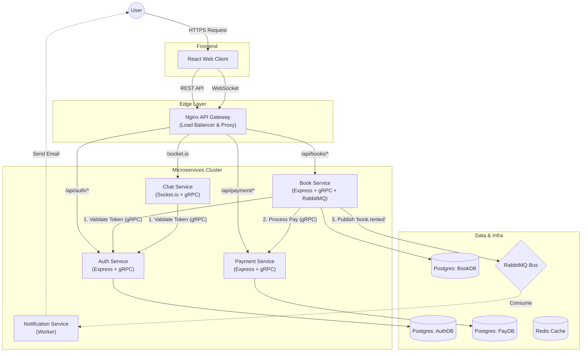
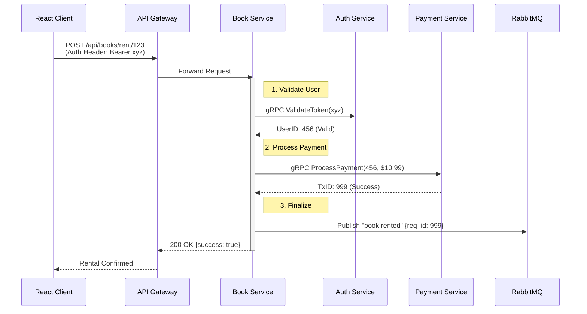
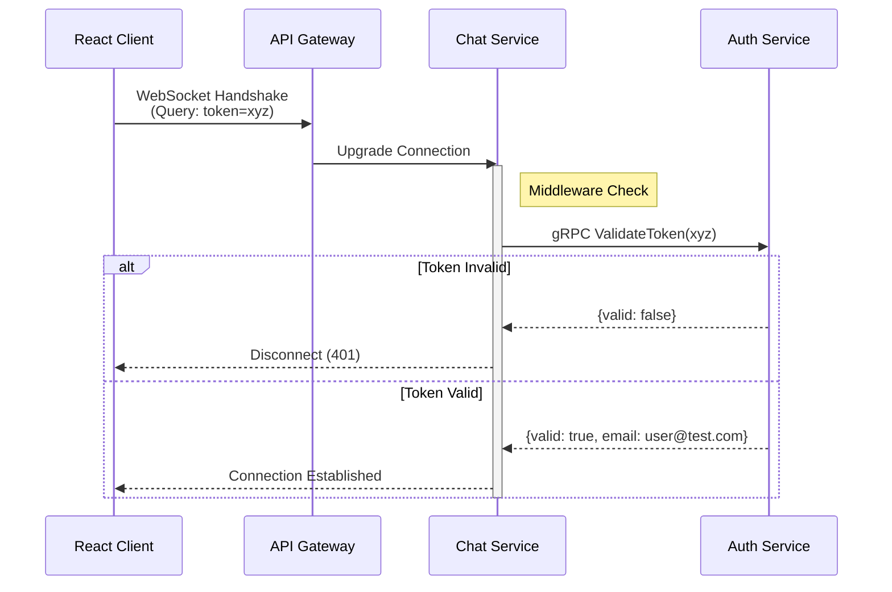

# PagePulse Microservices Architecture

PagePulse is a book rental and reading platform built using a **Microservices Architecture**. This document details the system design, communication patterns, and service responsibilities.

## 🏗 Detailed System Architecture

The following diagram illustrates the complete flow of data, from the user's browser to the database, including synchronous (gRPC) and asynchronous (RabbitMQ) patterns.

## 🔄 Detailed Request Flows

### 1. Book Rental Flow (Synchronous Orchestration)
When a user clicks "Rent Book", the system performs a multi-step synchronous transaction across three services.

### 2. Chat Connection Flow (WebSocket + gRPC)
Chat requires instant authentication during the WebSocket handshake.

## 🔌 Communication Patterns

### 1. External Communication (REST/WebSocket)
*   **API Gateway (Nginx)**: The single entry point for all client requests. It routes traffic based on URL paths (`/api/auth`, `/api/books`) to the appropriate backend service.
*   **Web Client**: Built with React (Vite). Connects to the Gateway for REST API calls and establishes a WebSocket connection for Chat.

### 2. Synchronous Inter-Service (gRPC)
Used when a service needs an immediate answer from another service. **These calls happen directly between services (Service-to-Service) and do NOT pass through the API Gateway.**
*   **Book Service -> Auth Service**: Validates user tokens included in requests.
*   **Book Service -> Payment Service**: Processes payments synchronously during a book rental transaction.
*   **Chat Service -> Auth Service**: Validates user tokens immediately upon WebSocket connection handshake.

### 3. Asynchronous Events (RabbitMQ)
Used for background tasks and decoupling.
*   **Event**: `book.rented`
    *   **Publisher**: `book-service`
    *   **Consumer**: `notification-service` (Sends email confirmation)

## 📦 Service Breakdown

| Service Name | Tech Stack | Responsibility | Port (Internal) |
| :--- | :--- | :--- | :--- |
| **Auth Service** | Express, JWT, gRPC | User management, Token generation & validation. | 3000 (HTTP), 50051 (gRPC) |
| **Book Service** | Express, gRPC Client | Book catalog, Rental logic. Orchestrates Auth & Payment calls. | 3000 (HTTP), 50052 (gRPC) |
| **Payment Service** | Express, gRPC Server | Payment processing logic. | 3000 (HTTP), 50053 (gRPC) |
| **Chat Service** | Socket.io, gRPC Client | Real-time messaging where users can discuss books. | 3000 (HTTP) |
| **Notification** | Node Worker, RabbitMQ | Listens for events and sends notifications. | N/A (Worker) |

