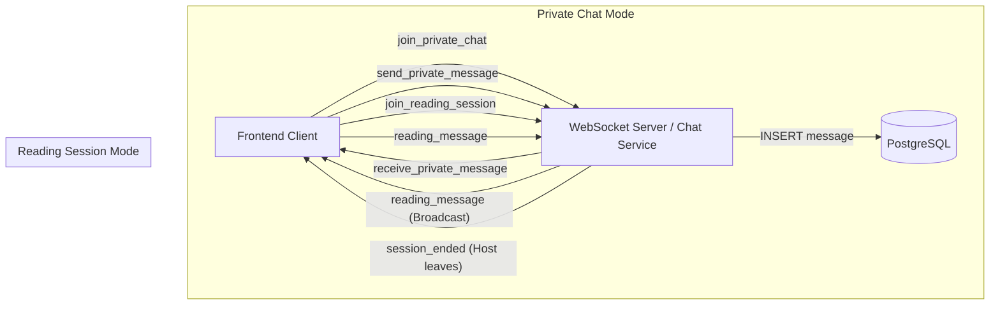

# Chat Service

The **Chat Service** handles real-time messaging for PagePulse. It supports two distinct modes of communication: **Private Chats** (persistent) and **Reading Sessions** (ephemeral).

## Architecture

The service uses **Socket.io** for real-time bidirectional communication and **PostgreSQL** for storing persistent data (private chats). Reading sessions are managed entirely in-memory for low-latency broadcast.



## Chat Modes

### 1. Private Chat 🔒
- **Purpose**: 1-on-1 text messaging between friends (WhatsApp style).
- **Storage**: Persistent. All messages are saved to the `messages` table in Postgres.
- **Lifecycle**: Permanent. The conversation history remains available forever.

### 2. Reading Session 📖
- **Purpose**: Live, transient chat overlay for users reading the same book together.
- **Storage**: **None**. Messages are ephemeral and exist only during the session.
- **Lifecycle**: Temporary. The session is destroyed when the **Host** disconnects.

## HTTP API


The service provides REST endpoints for chat management. All endpoints return JSON.

### 1. Initiate Private Chat 🔒
- **Endpoint**: `POST /private`
- **Body:**
    ```json
    {
        "myId": "UUID",
        "targetUserId": "UUID"
    }
    ```
- **Response:**
    - If chat exists:
        ```json
        { "conversationId": "UUID", "created": false }
        ```
    - If new chat created:
        ```json
        { "conversationId": "UUID", "created": true }
        ```
- **Description:** Finds or creates a private chat between two users. Checks for block status (cannot chat if blocked).

### 2. Get Private Chat Message History
- **Endpoint**: `GET /private/:conversationId/messages`
- **Query Params:**
    - `limit` (default 50): Max messages to return
    - `before`: ISO timestamp for pagination (fetch older messages)
- **Response:**
    ```json
    {
        "messages": [
            {
                "message_id": "UUID",
                "conversation_id": "UUID",
                "sender_id": "UUID",
                "content": "string",
                "sent_at": "2024-01-01T12:00:00.000Z"
            }
        ],
        "hasMore": true
    }
    ```
- **Description:** Returns messages for a private chat, newest first (chronological in response). Supports pagination.

### 3. Get User's Conversations List
- **Endpoint**: `GET /conversations/:userId`
- **Response:**
    ```json
    {
        "conversations": [
            {
                "conversation_id": "UUID",
                "type": "private",
                "created_at": "2024-01-01T12:00:00.000Z",
                "last_message": {
                    "message_id": "UUID",
                    "sender_id": "UUID",
                    "content": "string",
                    "sent_at": "2024-01-01T12:00:00.000Z"
                },
                "other_participants": ["UUID"]
            }
        ]
    }
    ```
- **Description:** Lists all private conversations for a user, with the latest message and other participant IDs.

### 4. Get Chat User Details (Proxy to Auth Service)
- **Endpoint**: `GET /chatusers/:id`
- **Response:**
    ```json
    {
        "id": "UUID",
        "username": "string",
        "email": "string",
        "avatar": "string|null"
    }
    ```
- **Description:** Returns user details for chat display. Fetched via gRPC from auth-service.

### 5. Initiate/Invite Book Reading Session 📖
- **Endpoint**: `POST /reading`
- **Body:**
    ```json
    {
        "myId": "UUID",
        "bookId": 123,
        "friendUsername": "optional_string"
    }
    ```
- **Response:**
    ```json
    { "conversationId": "UUID" }
    ```
- **Description:** Creates a new book reading session. The caller is the host. Optionally invites a friend by username.

## WebSocket API

Connect to the service via: `ws://localhost:4000` (or via API Gateway at `/api/chat`).

### Events

> [!IMPORTANT]
> The **Event Names** below are **FIXED** in the backend code. Frontend implementation **MUST** use these exact strings.

#### ➤ Private Chat

| Event | Direction | Payload | Description |
| :--- | :--- | :--- | :--- |
| `join_private_chat` | Client -> Server | `conversationId` (string) | Joins a unified room for a persistent chat. |
| `send_private_message` | Client -> Server | `{ conversation_id, sender_id, content }` | Sends a message. Saved to DB. |
| `receive_private_message` | Server -> Client | `{ message_id, conversation_id, sender_id, content, sent_at }` | Broadcasts the new message to participants. |

#### ➤ Reading Session

| Event | Direction | Payload | Description |
| :--- | :--- | :--- | :--- |
| `join_reading_session` | Client -> Server | `{ conversationId, userId, bookId }` | Joins a live session. First joiner becomes **Host**. |
| `reading_message` | Client -> Server | `{ conversationId, sender, content }` | Sends a live chat message. **NOT saved to DB.** |
| `reading_message` | Server -> Client | `{ sender, content, time }` | Broadcasts the live message to the room. |
| `session_ended` | Server -> Client | `null` | Sent when the **Host** disconnects. Clients should close the chat UI. |

#### ➤ Public Book Room

| Event | Direction | Payload | Description |
| :--- | :--- | :--- | :--- |
| `join_book_room` | Client -> Server | `{ bookId, userId }` | Joins a public book room for group chat. |
| `leave_book_room` | Client -> Server | `{ bookId, userId }` | Leaves the public book room. |
| `user_joined_book` | Server -> Client | `{ userId, count }` | Notifies room when a user joins. |
| `user_left_book` | Server -> Client | `{ userId, count }` | Notifies room when a user leaves. |
| `request_active_users` | Client -> Server | `{ bookId }` | Requests the list of active users in a book room. |
| `active_users` | Server -> Client | `[userId, ...]` | List of user IDs currently in the room. |

## Database Schema

```sql
CREATE TABLE conversations (
    conversation_id UUID PRIMARY KEY,
    type TEXT CHECK (type IN ('private', 'book')),
    book_id INT NULL,
    host_user_id UUID NULL, -- Active host for book sessions
    created_at TIMESTAMP
);

CREATE TABLE messages (
    message_id UUID PRIMARY KEY,
    conversation_id UUID REFERENCES conversations,
    sender_id UUID,
    sent_at TIMESTAMP
);
```

### Table: `conversations`
| Column           | Type    | Description                                 |
|------------------|---------|---------------------------------------------|
| conversation_id  | UUID    | Primary key, unique conversation identifier |
| type             | TEXT    | 'private' or 'book'                         |
| book_id          | INT     | Book ID for reading sessions (nullable)      |
| host_user_id     | UUID    | Host user for book sessions (nullable)       |
| created_at       | TIMESTAMP | Creation timestamp                        |

### Table: `conversation_participants`
| Column           | Type    | Description                                 |
|------------------|---------|---------------------------------------------|
| conversation_id  | UUID    | Conversation ID (foreign key)               |
| user_id          | UUID    | User ID (participant)                       |
| (PK: conversation_id, user_id) |         | Composite primary key                |

### Table: `messages`
| Column           | Type    | Description                                 |
|------------------|---------|---------------------------------------------|
| message_id       | UUID    | Primary key, unique message identifier      |
| conversation_id  | UUID    | Conversation ID (foreign key)               |
| sender_id        | UUID    | User ID of sender                           |
| content          | TEXT    | Message content                             |
| sent_at          | TIMESTAMP | When the message was sent                 |

**Note:** Only private chats are persisted in the `messages` table. Reading session and public book room messages are ephemeral and not stored in the database.

## Client Integration Flow

The Frontend is **dumb**. It relies on the Backend to do all the work.

### 1. Private Chat Flow
When user clicks "Chat with Alice":
1. **Frontend**: Call `POST /private` with `{ targetUserId: "..." }`.
2. **Backend**: Finds Alice, checks if chat exists, or creates one. Returns `conversationId`.
3. **Frontend**: Connects WebSocket and emits `join_private_chat` with that ID.

```javascript
// 1. Ask Backend to setup the chat
const res = await fetch('http://localhost:4000/private', {
    method: 'POST',
    body: JSON.stringify({ myId: "...", targetUserId: "..." })
});
const { conversationId } = await res.json();

// 2. Connect & Join
socket.emit("join_private_chat", conversationId);
```

### 2. Reading Session Flow
When user opens a book or invites a friend:
1. **Frontend**: Call `POST /reading` with `{ bookId: 84 }`.
2. **Backend**: Creates session, sets you as Host. Returns `conversationId`.
3. **Frontend**: Connects WebSocket and emits `join_reading_session`.

```javascript
// 1. Ask Backend to start session
const res = await fetch('http://localhost:4000/reading', {
    method: 'POST',
    body: JSON.stringify({ myId: "...", bookId: 84 })
});
const { conversationId } = await res.json();

// 2. Connect & Join
socket.emit("join_reading_session", { conversationId, userId: "..." });
```
